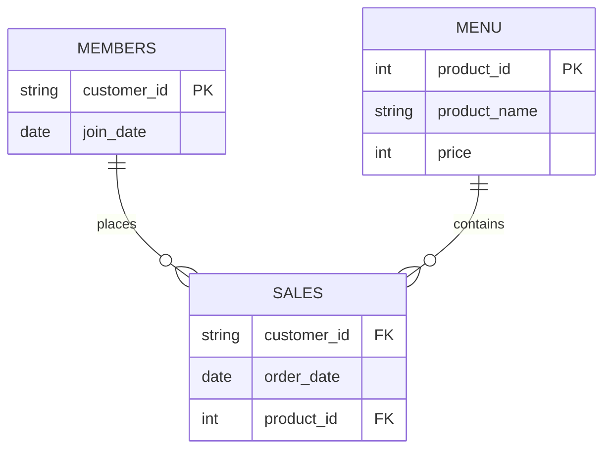

# Customer-trend-analysis (Danny's Restaurant)

## CONTEXT
This is my solution to a Case Study from the 8 Week SQL Challenge on 🔗 [Source](https://8weeksqlchallenge.com/case-study-1/)
The case study is based on a restaurant's sales, menu, and membership data, requiring SQL to answer real-world business questions. It covers core SQL concepts such as joins, aggregations, window functions, common table expressions (CTEs), and conditional logic. The goal is to strengthen SQL problem-solving skills by analyzing customer behavior and business performance using practical scenarios.
This repo documents my full process — from reading the business problem, to writing and debugging each query— rather than just the final SQL.
 
## Problem Statement 
Danny's Diner wants to better understand its customers and evaluate the impact of its newly launched membership program launched in 2021 as he seriously loves Japanese food.The restaurant needs to analyze customer purchasing behavior using historical sales, menu, and membership data.
The goal is to identify purchasing trends, evaluate member engagement, measure spending habits, and calculate reward points. This case study leverages SQL to solve real-world business problems and generate actionable insights that can improve customer retention and business performance.
## Data Overview 
Three tables were used:
### sales —
records of what each customer ordered and when (customer ID, order date, product ID).
### menu —
maps each product ID to its name and price.
### members — 
tracks which customers joined the loyalty program, and when.
Most questions need sales joined to menu to make sense of what was actually bought, and some require joining to members to compare behavior before vs after someone became a member.
 

## ER DIAGRAM 

 

## Skills Applied 
+ Joins — combining sales, menu, and members to connect orders to product info and membership status
+ Aggregations — SUM, COUNT for total spend, visit counts, and item popularity
+ CTEs — breaking multi-step logic (like ranking items per customer) into readable chunks
+ Window Functions — RANK() / DENSE_RANK() for things like "first item purchased" or "top ranked product per customer"
+ CASE WHEN — conditional logic, e.g. calculating loyalty points with different multipliers for different products
+ Date Functions — comparing order dates to membership join dates to split "before vs after member" behavior

## CASE STUDY QUESTIONS 
1) What is the total amount each customer spent at the restaurant?
2) How many days has each customer visited the restaurant?
3) What was the first item from the menu purchased by each customer?
4) What is the most purchased item on the menu and how many times was it purchased by all customers?
5) Which item was the most popular for each customer?
6) Which item was purchased first by the customer after they became a member?
7) Which item was purchased just before the customer became a member?
8) What is the total items and amount spent for each member before they became a member?
9) If each $1 spent equates to 10 points and sushi has a 2x points multiplier - how many points would each customer have?
10) The first week after a customer joins the program (including their join date) they earn 2x points on all items, not just sushi - how many points do customer    A and B have at the end of January?
  

     ## KEY INSIGHTS
    * ### Customer spending patterns varying significantly
      with some customers contributing substantially more revenue than others. Identifying high-value customers can help the business design targeted loyalty and retention strategies.

    * ### Menu concentration risk
      Ramen accounts for the largest share of total orders, suggesting revenue is concentrated in a single item rather than spread evenly across the menu.
      
    * ### Point System bias towards product type and Time Period 
     The 2x multiplier on sushi rewards customers by product preference rather than total spend, which may unintentionally skew loyalty outcomes.Time-based bonus       periods and product-specific multipliers play a key role in maximizing customer engagement.
    
    * ### Visit frequency vs. spend are not correlated
     The customer with the most visits is not the highest spender — order value, not frequency, drives revenue leadership..

    * ### Customer Preferences were identifiable
      Each customer showed a tendency to purchase certain menu items more frequently. Understanding these preferences can support personalized promotions and menu      recommendations.

      # SQL AS AN ANALYTICAL TOOL
     - This case study shows SQL doing more than just retrieving data — it's used to answer layered business questions directly at the query level, without needing a separate analytics tool.
    - Turning raw transaction logs into behavioral insight
The sales table alone is just a list of orders. SQL joins convert that into meaningful metrics — total spend per customer, favorite items, visit frequency — by connecting it to menu and members.
- Window functions for per-customer ranking
Instead of aggregating the whole table at once, RANK()/DENSE_RANK() partitioned by customer answer questions like "what did this customer order first" or "what's their top item" — without needing to write a separate query per customer.
- CTEs for readable, multi-step logic
Some questions (like ranking items after filtering to post-membership orders) require multiple logical steps. CTEs let each step stay isolated and named, so the final query reads like a sequence of business logic rather than one dense nested query.
- CASE WHEN for business rules inside the query
The loyalty points calculation (2x multiplier on sushi) is a business rule, not just a data transformation — encoding it directly in SQL via CASE WHEN shows SQL's ability to model real operational logic, not just report on it.
- Date logic for behavioral segmentation
Comparing order dates to membership join dates turns a single flat table into a before/after behavioral analysis — the kind of segmentation that's normally associated with dedicated analytics tools, done here with plain date comparisons.
